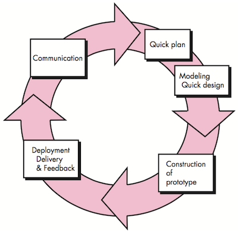
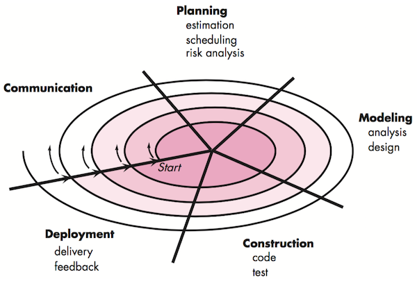
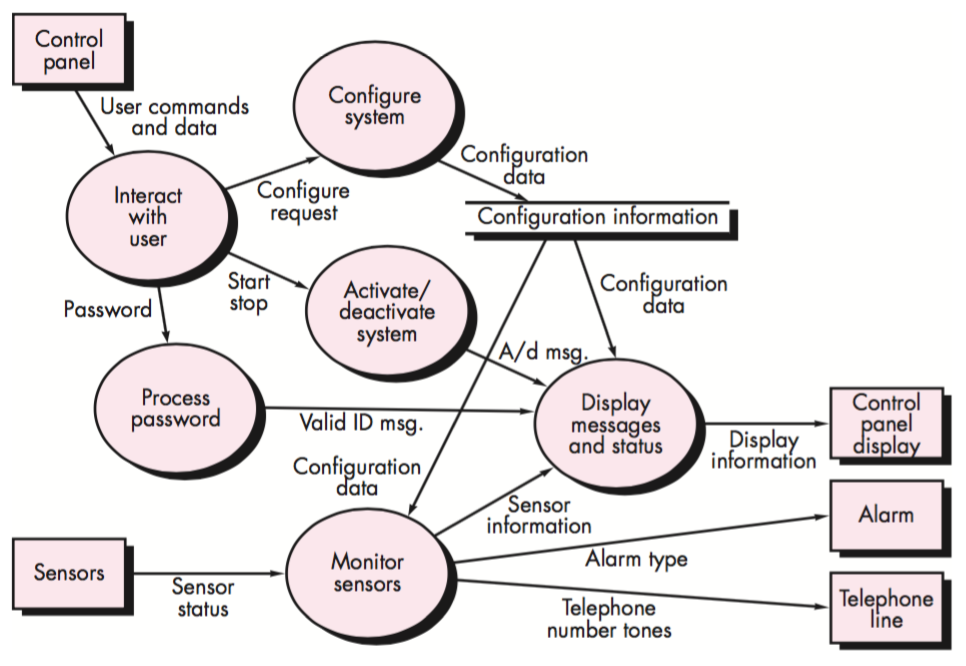
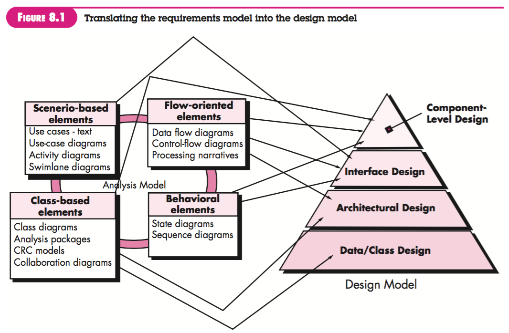

# Software Engineering

  * [Software Engineering](#software-engineering)
    * [软件过程(The Software Process)](#%E8%BD%AF%E4%BB%B6%E8%BF%87%E7%A8%8Bthe-software-process)
      * [通用的软件过程框架包含的活动](#%E9%80%9A%E7%94%A8%E7%9A%84%E8%BD%AF%E4%BB%B6%E8%BF%87%E7%A8%8B%E6%A1%86%E6%9E%B6%E5%8C%85%E5%90%AB%E7%9A%84%E6%B4%BB%E5%8A%A8)
      * [惯用过程模型（Prescriptive Process Models）](#%E6%83%AF%E7%94%A8%E8%BF%87%E7%A8%8B%E6%A8%A1%E5%9E%8Bprescriptive-process-models)
        * [瀑布模型（The Waterfall Model）](#%E7%80%91%E5%B8%83%E6%A8%A1%E5%9E%8Bthe-waterfall-model)
        * [增量过程模型（Incremental Process Models）](#%E5%A2%9E%E9%87%8F%E8%BF%87%E7%A8%8B%E6%A8%A1%E5%9E%8Bincremental-process-models)
        * [演化过程模型（Evolutionary Process Models）](#%E6%BC%94%E5%8C%96%E8%BF%87%E7%A8%8B%E6%A8%A1%E5%9E%8Bevolutionary-process-models)
          * [原型开发（Prototyping）](#%E5%8E%9F%E5%9E%8B%E5%BC%80%E5%8F%91prototyping)
          * [螺旋模型（The Spiral Model）](#%E8%9E%BA%E6%97%8B%E6%A8%A1%E5%9E%8Bthe-spiral-model)
      * [敏捷过程（Agile Process）](#%E6%95%8F%E6%8D%B7%E8%BF%87%E7%A8%8Bagile-process)
        * [极限编程（Extreme Programming (XP)）](#%E6%9E%81%E9%99%90%E7%BC%96%E7%A8%8Bextreme-programming-xp)
    * [软件工程实践（Software Engineering Practice）](#%E8%BD%AF%E4%BB%B6%E5%B7%A5%E7%A8%8B%E5%AE%9E%E8%B7%B5software-engineering-practice)
      * [需求工程（Requirements Engineering）](#%E9%9C%80%E6%B1%82%E5%B7%A5%E7%A8%8Brequirements-engineering)
        * [需求工程的活动](#%E9%9C%80%E6%B1%82%E5%B7%A5%E7%A8%8B%E7%9A%84%E6%B4%BB%E5%8A%A8)
        * [需求模型](#%E9%9C%80%E6%B1%82%E6%A8%A1%E5%9E%8B)
          * [场景模型（Scenario\-based models）](#%E5%9C%BA%E6%99%AF%E6%A8%A1%E5%9E%8Bscenario-based-models)
            * [用例（Use Case）](#%E7%94%A8%E4%BE%8Buse-case)
            * [用例图（Use\-case Diagram）](#%E7%94%A8%E4%BE%8B%E5%9B%BEuse-case-diagram)
            * [活动图（Activity Diagram）](#%E6%B4%BB%E5%8A%A8%E5%9B%BEactivity-diagram)
            * [泳道图（Swimlane Diagram）](#%E6%B3%B3%E9%81%93%E5%9B%BEswimlane-diagram)
          * [数据模型（Data models）](#%E6%95%B0%E6%8D%AE%E6%A8%A1%E5%9E%8Bdata-models)
          * [面向类的模型（Class\-oriented models）](#%E9%9D%A2%E5%90%91%E7%B1%BB%E7%9A%84%E6%A8%A1%E5%9E%8Bclass-oriented-models)
            * [类图（Class diagram）](#%E7%B1%BB%E5%9B%BEclass-diagram)
            * [类－职责－协作者建模（Class\-Responsibility\-Collaborator Modeling, CRC）](#%E7%B1%BB%E8%81%8C%E8%B4%A3%E5%8D%8F%E4%BD%9C%E8%80%85%E5%BB%BA%E6%A8%A1class-responsibility-collaborator-modeling-crc)
          * [面向流程的模型（Flow\-oriented models）](#%E9%9D%A2%E5%90%91%E6%B5%81%E7%A8%8B%E7%9A%84%E6%A8%A1%E5%9E%8Bflow-oriented-models)
            * [数据流图（Data Flow Diagram, DFD）](#%E6%95%B0%E6%8D%AE%E6%B5%81%E5%9B%BEdata-flow-diagram-dfd)
            * [状态图（State Diagram）](#%E7%8A%B6%E6%80%81%E5%9B%BEstate-diagram)
          * [行为模型（Behavioral models）](#%E8%A1%8C%E4%B8%BA%E6%A8%A1%E5%9E%8Bbehavioral-models)
            * [状态图（State Diagram）](#%E7%8A%B6%E6%80%81%E5%9B%BEstate-diagram-1)
            * [顺序图（Sequence Diagram）](#%E9%A1%BA%E5%BA%8F%E5%9B%BEsequence-diagram)
        * [分析模式（Analysis Pattern）](#%E5%88%86%E6%9E%90%E6%A8%A1%E5%BC%8Fanalysis-pattern)
        * [Web应用的需求建模](#web%E5%BA%94%E7%94%A8%E7%9A%84%E9%9C%80%E6%B1%82%E5%BB%BA%E6%A8%A1)
      * [设计（Design）](#%E8%AE%BE%E8%AE%A1design)

笔记基于软件工程：实践者的研究方法第七版（Software Engineering: A Practitioner's Approach 7th Edition）
## 软件过程(The Software Process)
定义：一个为建造高质量软件所需要完成的活动、动作和任务的框架。

### 通用的软件过程框架包含的活动
- 沟通（Communication）
- 策划（Planning）：传统／敏捷
- 建模（Modeling）：需求模型（分析模型）、设计模型
- 构建（Construction）：编码、测试
- 部署（Deployment）：交付、支持、反馈

### 惯用过程模型（Prescriptive Process Models）
#### 瀑布模型（The Waterfall Model）

#### 增量过程模型（Incremental Process Models）

#### 演化过程模型（Evolutionary Process Models）
##### 原型开发（Prototyping）

##### 螺旋模型（The Spiral Model）

### 敏捷过程（Agile Process）
#### 极限编程（Extreme Programming (XP)）

## 软件工程实践（Software Engineering Practice）
定义：实践就是软件工程师每天使用的概念、原则、方法和开发工具的集合。

### 需求工程（Requirements Engineering）
定义：致力于不断理解需求的大量任务和工作

#### 需求工程的活动
- 起始（Inception）
- 导出（Elicitation）
- 精化（Elaboration）
- 协商（Negotiation）
- 规格说明（Specification）
- 确认（Validation）
- 管理（Requirements management）

#### 需求模型
分析建模（requirements modeling）：结构化分析（structured analysis）、面向对象分析（object-oriented analysis）
##### 场景模型（Scenario-based models）
###### 用例（Use Case）

###### 用例图（Use-case Diagram）

###### 活动图（Activity Diagram）

###### 泳道图（Swimlane Diagram）

##### 数据模型（Data models）
实体－关系图（Entity-Relationship Diagrams）
##### 面向类的模型（Class-oriented models）
###### 类图（Class diagram）

###### 类－职责－协作者建模（Class-Responsibility-Collaborator Modeling, CRC）

##### 面向流程的模型（Flow-oriented models）
###### 数据流图（Data Flow Diagram, DFD）
- Context-level DFD for the SafeHome security function

- Level 1 DFD for the SafeHome security function

- Level 2 DFD that refines the monitor sensors process

###### 状态图（State Diagram）

##### 行为模型（Behavioral models）
###### 状态图（State Diagram）

###### 顺序图（Sequence Diagram）

#### 分析模式（Analysis Pattern）
定义：分析模式在特定应用领域内提供了一些解决方案（如类、功能、行为），在为许多应用项目建模时可以重复使用。
如：执行期－传感器（Actuator-Sensor）

#### Web应用的需求建模
内容模型、交互模型（用例、顺序图、状态图、用户界面原型）、功能模型（用例、活动图）、导航模型、配置模型（部署图）

### 设计（Design）
定义：软件设计包括一系列原理、概念和实践，可以指导高质量的系统或产品开发。

#### 设计过程（The Design Process）
1. 
