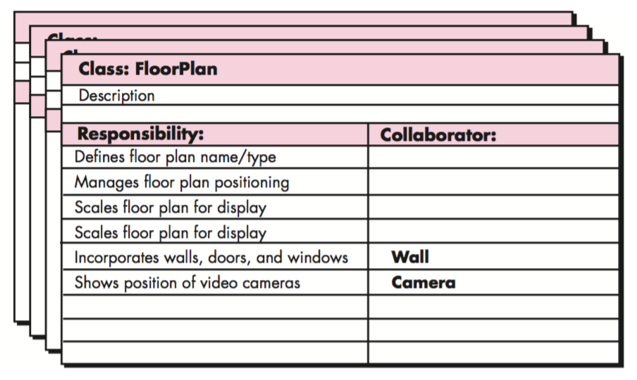
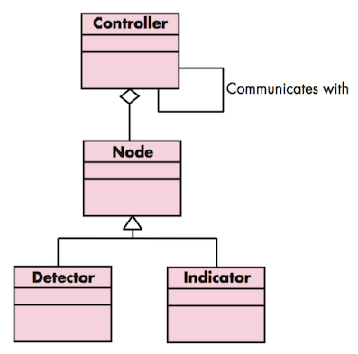

# Software Engineering

* [Software Engineering](#software-engineering)
  * [软件过程(The Software Process)](#%E8%BD%AF%E4%BB%B6%E8%BF%87%E7%A8%8Bthe-software-process)
    * [通用的软件过程框架包含的活动](#%E9%80%9A%E7%94%A8%E7%9A%84%E8%BD%AF%E4%BB%B6%E8%BF%87%E7%A8%8B%E6%A1%86%E6%9E%B6%E5%8C%85%E5%90%AB%E7%9A%84%E6%B4%BB%E5%8A%A8)
    * [惯用过程模型（Prescriptive Process Models）](#%E6%83%AF%E7%94%A8%E8%BF%87%E7%A8%8B%E6%A8%A1%E5%9E%8Bprescriptive-process-models)
      * [瀑布模型（The Waterfall Model）](#%E7%80%91%E5%B8%83%E6%A8%A1%E5%9E%8Bthe-waterfall-model)
      * [增量过程模型（Incremental Process Models）](#%E5%A2%9E%E9%87%8F%E8%BF%87%E7%A8%8B%E6%A8%A1%E5%9E%8Bincremental-process-models)
      * [演化过程模型（Evolutionary Process Models）](#%E6%BC%94%E5%8C%96%E8%BF%87%E7%A8%8B%E6%A8%A1%E5%9E%8Bevolutionary-process-models)
        * [原型开发（Prototyping）](#%E5%8E%9F%E5%9E%8B%E5%BC%80%E5%8F%91prototyping)
        * [螺旋模型（The Spiral Model）](#%E8%9E%BA%E6%97%8B%E6%A8%A1%E5%9E%8Bthe-spiral-model)
    * [统一过程（the Unified Process）](#%E7%BB%9F%E4%B8%80%E8%BF%87%E7%A8%8Bthe-unified-process)
    * [敏捷过程（Agile Process）](#%E6%95%8F%E6%8D%B7%E8%BF%87%E7%A8%8Bagile-process)
      * [极限编程（Extreme Programming (XP)）](#%E6%9E%81%E9%99%90%E7%BC%96%E7%A8%8Bextreme-programming-xp)
      * [其他敏捷过程模型](#%E5%85%B6%E4%BB%96%E6%95%8F%E6%8D%B7%E8%BF%87%E7%A8%8B%E6%A8%A1%E5%9E%8B)
  * [软件工程实践（Software Engineering Practice）](#%E8%BD%AF%E4%BB%B6%E5%B7%A5%E7%A8%8B%E5%AE%9E%E8%B7%B5software-engineering-practice)
    * [需求工程（Requirements Engineering）](#%E9%9C%80%E6%B1%82%E5%B7%A5%E7%A8%8Brequirements-engineering)
      * [需求工程的活动](#%E9%9C%80%E6%B1%82%E5%B7%A5%E7%A8%8B%E7%9A%84%E6%B4%BB%E5%8A%A8)
      * [需求模型](#%E9%9C%80%E6%B1%82%E6%A8%A1%E5%9E%8B)
        * [场景模型（Scenario\-based models）](#%E5%9C%BA%E6%99%AF%E6%A8%A1%E5%9E%8Bscenario-based-models)
          * [用例（Use Case）](#%E7%94%A8%E4%BE%8Buse-case)
          * [用例图（Use\-case Diagram）](#%E7%94%A8%E4%BE%8B%E5%9B%BEuse-case-diagram)
          * [活动图（Activity Diagram）](#%E6%B4%BB%E5%8A%A8%E5%9B%BEactivity-diagram)
          * [泳道图（Swimlane Diagram）](#%E6%B3%B3%E9%81%93%E5%9B%BEswimlane-diagram)
        * [数据模型（Data models）](#%E6%95%B0%E6%8D%AE%E6%A8%A1%E5%9E%8Bdata-models)
        * [面向类的模型（Class\-oriented models）](#%E9%9D%A2%E5%90%91%E7%B1%BB%E7%9A%84%E6%A8%A1%E5%9E%8Bclass-oriented-models)
          * [类图（Class diagram）](#%E7%B1%BB%E5%9B%BEclass-diagram)
          * [类－职责－协作者建模（Class\-Responsibility\-Collaborator Modeling, CRC）](#%E7%B1%BB%E8%81%8C%E8%B4%A3%E5%8D%8F%E4%BD%9C%E8%80%85%E5%BB%BA%E6%A8%A1class-responsibility-collaborator-modeling-crc)
        * [面向流程的模型（Flow\-oriented models）](#%E9%9D%A2%E5%90%91%E6%B5%81%E7%A8%8B%E7%9A%84%E6%A8%A1%E5%9E%8Bflow-oriented-models)
          * [数据流图（Data Flow Diagram, DFD）](#%E6%95%B0%E6%8D%AE%E6%B5%81%E5%9B%BEdata-flow-diagram-dfd)
          * [状态图（State Diagram）](#%E7%8A%B6%E6%80%81%E5%9B%BEstate-diagram)
        * [行为模型（Behavioral models）](#%E8%A1%8C%E4%B8%BA%E6%A8%A1%E5%9E%8Bbehavioral-models)
          * [状态图（State Diagram）](#%E7%8A%B6%E6%80%81%E5%9B%BEstate-diagram-1)
          * [顺序图（Sequence Diagram）](#%E9%A1%BA%E5%BA%8F%E5%9B%BEsequence-diagram)
      * [分析模式（Analysis Pattern）](#%E5%88%86%E6%9E%90%E6%A8%A1%E5%BC%8Fanalysis-pattern)
      * [Web应用的需求建模](#web%E5%BA%94%E7%94%A8%E7%9A%84%E9%9C%80%E6%B1%82%E5%BB%BA%E6%A8%A1)
    * [设计（Design）](#%E8%AE%BE%E8%AE%A1design)
      * [设计概念](#%E8%AE%BE%E8%AE%A1%E6%A6%82%E5%BF%B5)
      * [设计模型](#%E8%AE%BE%E8%AE%A1%E6%A8%A1%E5%9E%8B)
      * [体系结构](#%E4%BD%93%E7%B3%BB%E7%BB%93%E6%9E%84)
        * [体系结构风格（Architecture Styles）](#%E4%BD%93%E7%B3%BB%E7%BB%93%E6%9E%84%E9%A3%8E%E6%A0%BCarchitecture-styles)
          * [以数据为中心的体系结构（Data\-centered architectures）](#%E4%BB%A5%E6%95%B0%E6%8D%AE%E4%B8%BA%E4%B8%AD%E5%BF%83%E7%9A%84%E4%BD%93%E7%B3%BB%E7%BB%93%E6%9E%84data-centered-architectures)
          * [数据流体系结构（Data\-flow architectures）](#%E6%95%B0%E6%8D%AE%E6%B5%81%E4%BD%93%E7%B3%BB%E7%BB%93%E6%9E%84data-flow-architectures)
          * [调用和返回体系结构（Call and return architectures）](#%E8%B0%83%E7%94%A8%E5%92%8C%E8%BF%94%E5%9B%9E%E4%BD%93%E7%B3%BB%E7%BB%93%E6%9E%84call-and-return-architectures)
          * [面向对象体系结构（Object\-oriented architectures）](#%E9%9D%A2%E5%90%91%E5%AF%B9%E8%B1%A1%E4%BD%93%E7%B3%BB%E7%BB%93%E6%9E%84object-oriented-architectures)
          * [层次体系结构（Layered architectures）](#%E5%B1%82%E6%AC%A1%E4%BD%93%E7%B3%BB%E7%BB%93%E6%9E%84layered-architectures)
        * [体系结构设计（Architecture Design）](#%E4%BD%93%E7%B3%BB%E7%BB%93%E6%9E%84%E8%AE%BE%E8%AE%A1architecture-design)
          * [1\. 系统环境的表示（Representing the System in Context）](#1-%E7%B3%BB%E7%BB%9F%E7%8E%AF%E5%A2%83%E7%9A%84%E8%A1%A8%E7%A4%BArepresenting-the-system-in-context)
          * [2\. 定义原型（Defining Archetypes）](#2-%E5%AE%9A%E4%B9%89%E5%8E%9F%E5%9E%8Bdefining-archetypes)
          * [3\. 将体系结构精化为构件（Refining the Architecture into Components）](#3-%E5%B0%86%E4%BD%93%E7%B3%BB%E7%BB%93%E6%9E%84%E7%B2%BE%E5%8C%96%E4%B8%BA%E6%9E%84%E4%BB%B6refining-the-architecture-into-components)
          * [4\. 描述系统实例（Describing Instantiations of the System）](#4-%E6%8F%8F%E8%BF%B0%E7%B3%BB%E7%BB%9F%E5%AE%9E%E4%BE%8Bdescribing-instantiations-of-the-system)
        * [评估可选的体系结构设计](#%E8%AF%84%E4%BC%B0%E5%8F%AF%E9%80%89%E7%9A%84%E4%BD%93%E7%B3%BB%E7%BB%93%E6%9E%84%E8%AE%BE%E8%AE%A1)
        * [使用数据流进行体系结构映射](#%E4%BD%BF%E7%94%A8%E6%95%B0%E6%8D%AE%E6%B5%81%E8%BF%9B%E8%A1%8C%E4%BD%93%E7%B3%BB%E7%BB%93%E6%9E%84%E6%98%A0%E5%B0%84)
          * [变换映射](#%E5%8F%98%E6%8D%A2%E6%98%A0%E5%B0%84)
          * [精化体系结构设计](#%E7%B2%BE%E5%8C%96%E4%BD%93%E7%B3%BB%E7%BB%93%E6%9E%84%E8%AE%BE%E8%AE%A1)
      * [构件（Component）](#%E6%9E%84%E4%BB%B6component)

笔记基于 软件工程：实践者的研究方法第七版（Software Engineering: A Practitioner's Approach 7th Edition）
## 软件过程(The Software Process)
定义：一个为建造高质量软件所需要完成的活动、动作和任务的框架。

### 通用的软件过程框架包含的活动
- 沟通（Communication）
- 策划（Planning）：传统／敏捷
- 建模（Modeling）：需求模型（分析模型）、设计模型
- 构建（Construction）：编码、测试
- 部署（Deployment）：交付、支持、反馈

### 惯用过程模型（Prescriptive Process Models）
#### 瀑布模型（The Waterfall Model）

#### 增量过程模型（Incremental Process Models）

#### 演化过程模型（Evolutionary Process Models）
##### 原型开发（Prototyping）

##### 螺旋模型（The Spiral Model）

### 统一过程（the Unified Process）

### 敏捷过程（Agile Process）
#### 极限编程（Extreme Programming (XP)）

#### 其他敏捷过程模型
- 自适应软件开发（Adaptive Software Development (ASD)）
- Scrum
- 动态系统开发方法（Dynamic Systems Development Method (DSDM)）
- Crystal
- 特征驱动开发（Feature Driven Development (FDD)）
- 精益软件开发（Lean Software Development (LSD)）
- 敏捷建模（Agile Modeling (AM)）
- 敏捷统一过程（Agile Unified Process (AUP)）

## 软件工程实践（Software Engineering Practice）
定义：实践就是软件工程师每天使用的概念、原则、方法和开发工具的集合。

### 需求工程（Requirements Engineering）
定义：致力于不断理解需求的大量任务和工作

#### 需求工程的活动
- 起始（Inception）
- 导出（Elicitation）
- 精化（Elaboration）
- 协商（Negotiation）
- 规格说明（Specification）
- 确认（Validation）
- 管理（Requirements management）

#### 需求模型
分析建模（requirements modeling）：结构化分析（structured analysis）、面向对象分析（object-oriented analysis）
##### 场景模型（Scenario-based models）
###### 用例（Use Case）

###### 用例图（Use-case Diagram）

###### 活动图（Activity Diagram）

###### 泳道图（Swimlane Diagram）

##### 数据模型（Data models）
实体－关系图（Entity-Relationship Diagrams）
##### 面向类的模型（Class-oriented models）
###### 类图（Class diagram）

###### 类－职责－协作者建模（Class-Responsibility-Collaborator Modeling, CRC）

##### 面向流程的模型（Flow-oriented models）
###### 数据流图（Data Flow Diagram, DFD）
- Context-level DFD for the SafeHome security function

- Level 1 DFD for the SafeHome security function

- Level 2 DFD that refines the monitor sensors process

###### 状态图（State Diagram）

##### 行为模型（Behavioral models）
###### 状态图（State Diagram）

###### 顺序图（Sequence Diagram）

#### 分析模式（Analysis Pattern）
定义：分析模式在特定应用领域内提供了一些解决方案（如类、功能、行为），在为许多应用项目建模时可以重复使用。
如：执行期－传感器（Actuator-Sensor）

#### Web应用的需求建模
内容模型、交互模型（用例、顺序图、状态图、用户界面原型）、功能模型（用例、活动图）、导航模型、配置模型（部署图）

### 设计（Design）
定义：软件设计包括一系列原理、概念和实践，可以指导高质量的系统或产品开发。

#### 设计概念
- 抽象（Abstraction）:过程抽象、数据抽象
- 体系结构（Architecture）
- 模式（Patterns）
- 关注点分离（Separation of Concerns）
- 模块化（Modularity）
- 信息隐蔽（Information Hiding）
- 功能独立（Functional Independence）：内聚性（cohesion，某个模块相关功能的强度）、耦合性（coupling，模块间的相互依赖性）
- 求精（Refinement）：细化
- 方面（Aspects）：横切系统需求方面的考虑；一个方面即一个模块
- 重构（Refactoring）
- 面向对象的设计概念（Object-Oriented Design Concepts）
- 设计类（Design Classes）：用户接口类（User interface classes）、业务域类（Business domain classes）、过程类（Process classes）、持久类（Persistent classes）、系统类（System classes）；完整性与充分性、原始性、高内聚性、低耦合性

#### 设计模型

- 数据设计元素
- 体系结构设计元素：来自于应用域（application domain）、需求模型和模式与风格的分类（available catalogs for patterns and styles）
- 接口设计元素：用户界面（user interface）；和其他系统、设备、网络或其他信息生成者或使用者的外部接口；各种设计构件之间的内部接口
- 构件级设计元素
- 部署级设计元素

#### 体系结构
定义：程序或计算系统的软件体系结构是指系统的一个或者多个结构，它包括软件构件、构件的外部可见属性以及它们之间的相互关系。
##### 体系结构风格（Architecture Styles）
###### 以数据为中心的体系结构（Data-centered architectures）

###### 数据流体系结构（Data-flow architectures）

###### 调用和返回体系结构（Call and return architectures）
主程序／子程序体系结构（Main program/subprogram architecture）

###### 面向对象体系结构（Object-oriented architectures）
###### 层次体系结构（Layered architectures）

##### 体系结构设计（Architecture Design）
###### 1. 系统环境的表示（Representing the System in Context）
体系结构环境图（Architectural Context Diagram, ACD）

###### 2. 定义原型（Defining Archetypes）
**结点**：表示住宅安全功能的输入和输出元素的内聚集合，例如，结点可能由如下元素构成：（1）各种传感器；（2）多种警报（输出）指示器 
**探测器**：对所有为目标系统提供信息的传感设备的抽象。 
**指示器**：表示所有指示警报条件发生的报警机械装置（例如：警报汽笛、闪灯、响铃）的抽象。 
**控制器**：对允许结点发出警报或者撤销警报的机械装置的抽象。如果控制器安装在网上，那么它们应该具有相互通信的能力。 

###### 3. 将体系结构精化为构件（Refining the Architecture into Components）
Overall architectural structure for SafeHome with top-level components

###### 4. 描述系统实例（Describing Instantiations of the System）
An instantiation of the security function with component elaboration

##### 评估可选的体系结构设计
- 体系结构权衡分析方法（Architecture Trade-Off Analysis Method, ATAM）
- 体系结构复杂性：共享依赖、流依赖、约束依赖
- 体系结构描述语言（Architectural Description Language, ADL）

##### 使用数据流进行体系结构映射
结构设计：从数据流图到软件体系结构的映射

1. 建立信息流的类型（the type of information flow is established）
2. 标注流的边界（flow boundaries are indicated）
3. 将DFD映射到程序结构（the DFD is mapped into the program structure）
4. 定义控制层级（control hierarchy is defined）
5. 使用设计度量和启发式精化产生的结果（the resultant structure is refined using design measures and heuristics）
6. 求精并细化体系结构描述（the architectural description is refined and elaborated）

###### 变换映射
**步骤1：评审基本系统模型** 

**步骤2：评审和精化软件的数据流图** 

**步骤3：确认DFD是否含有变换流或事物流特征** 
**步骤4：通过确定输入和输出流的边界，分离出变换中心** 
**步骤5：完成“第一级分解”** 

**步骤6：完成“第二级分解”** 

**步骤7：使用提高软件质量的设计启发式方法，精化第一次迭代得到的体系结构** 

###### 精化体系结构设计

#### 构件（Component）
