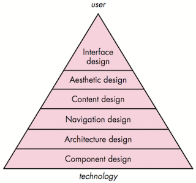
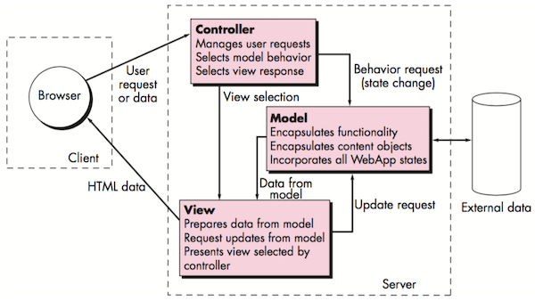
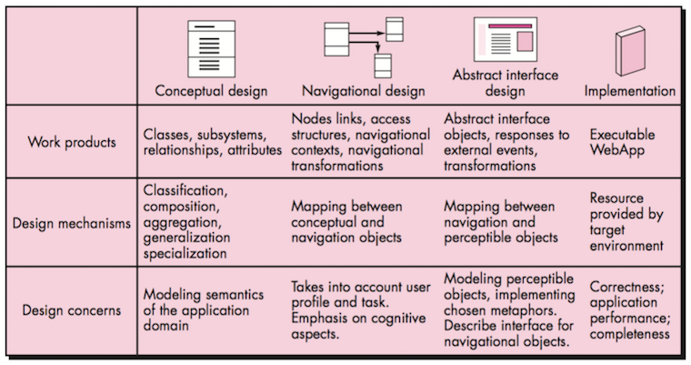
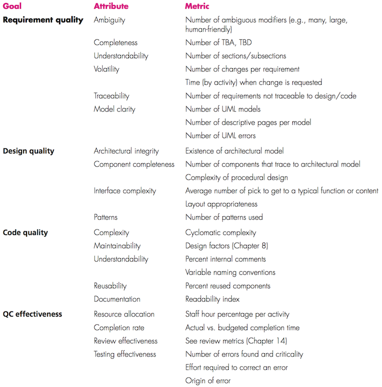
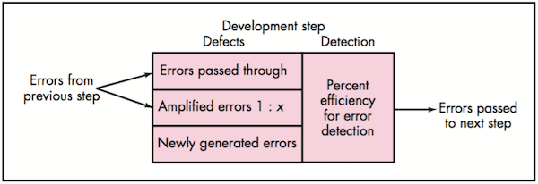
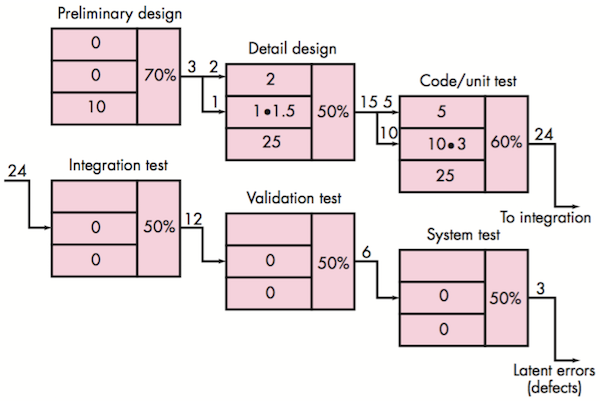
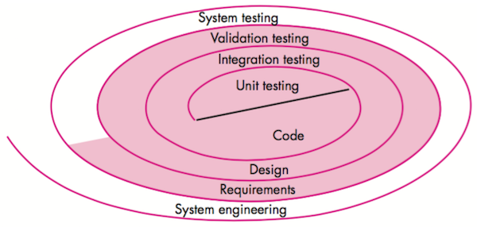
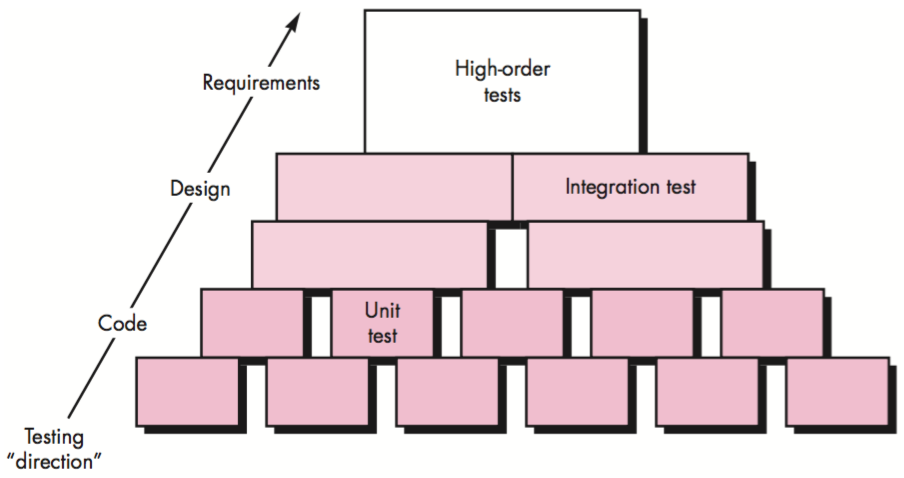

# Software Engineering

* [Software Engineering](#software-engineering)
  * [软件过程(The Software Process)](#%E8%BD%AF%E4%BB%B6%E8%BF%87%E7%A8%8Bthe-software-process)
    * [通用的软件过程框架包含的活动](#%E9%80%9A%E7%94%A8%E7%9A%84%E8%BD%AF%E4%BB%B6%E8%BF%87%E7%A8%8B%E6%A1%86%E6%9E%B6%E5%8C%85%E5%90%AB%E7%9A%84%E6%B4%BB%E5%8A%A8)
    * [惯用过程模型（Prescriptive Process Models）](#%E6%83%AF%E7%94%A8%E8%BF%87%E7%A8%8B%E6%A8%A1%E5%9E%8Bprescriptive-process-models)
      * [瀑布模型（The Waterfall Model）](#%E7%80%91%E5%B8%83%E6%A8%A1%E5%9E%8Bthe-waterfall-model)
      * [增量过程模型（Incremental Process Models）](#%E5%A2%9E%E9%87%8F%E8%BF%87%E7%A8%8B%E6%A8%A1%E5%9E%8Bincremental-process-models)
      * [演化过程模型（Evolutionary Process Models）](#%E6%BC%94%E5%8C%96%E8%BF%87%E7%A8%8B%E6%A8%A1%E5%9E%8Bevolutionary-process-models)
        * [原型开发（Prototyping）](#%E5%8E%9F%E5%9E%8B%E5%BC%80%E5%8F%91prototyping)
        * [螺旋模型（The Spiral Model）](#%E8%9E%BA%E6%97%8B%E6%A8%A1%E5%9E%8Bthe-spiral-model)
    * [统一过程（the Unified Process）](#%E7%BB%9F%E4%B8%80%E8%BF%87%E7%A8%8Bthe-unified-process)
    * [敏捷过程（Agile Process）](#%E6%95%8F%E6%8D%B7%E8%BF%87%E7%A8%8Bagile-process)
      * [极限编程（Extreme Programming (XP)）](#%E6%9E%81%E9%99%90%E7%BC%96%E7%A8%8Bextreme-programming-xp)
      * [其他敏捷过程模型](#%E5%85%B6%E4%BB%96%E6%95%8F%E6%8D%B7%E8%BF%87%E7%A8%8B%E6%A8%A1%E5%9E%8B)
  * [软件工程实践（Software Engineering Practice）](#%E8%BD%AF%E4%BB%B6%E5%B7%A5%E7%A8%8B%E5%AE%9E%E8%B7%B5software-engineering-practice)
    * [需求工程（Requirements Engineering）](#%E9%9C%80%E6%B1%82%E5%B7%A5%E7%A8%8Brequirements-engineering)
      * [需求工程的活动](#%E9%9C%80%E6%B1%82%E5%B7%A5%E7%A8%8B%E7%9A%84%E6%B4%BB%E5%8A%A8)
      * [需求模型](#%E9%9C%80%E6%B1%82%E6%A8%A1%E5%9E%8B)
        * [场景模型（Scenario\-based models）](#%E5%9C%BA%E6%99%AF%E6%A8%A1%E5%9E%8Bscenario-based-models)
          * [用例（Use Case）](#%E7%94%A8%E4%BE%8Buse-case)
          * [用例图（Use\-case Diagram）](#%E7%94%A8%E4%BE%8B%E5%9B%BEuse-case-diagram)
          * [活动图（Activity Diagram）](#%E6%B4%BB%E5%8A%A8%E5%9B%BEactivity-diagram)
          * [泳道图（Swimlane Diagram）](#%E6%B3%B3%E9%81%93%E5%9B%BEswimlane-diagram)
        * [数据模型（Data models）](#%E6%95%B0%E6%8D%AE%E6%A8%A1%E5%9E%8Bdata-models)
        * [面向类的模型（Class\-oriented models）](#%E9%9D%A2%E5%90%91%E7%B1%BB%E7%9A%84%E6%A8%A1%E5%9E%8Bclass-oriented-models)
          * [类图（Class diagram）](#%E7%B1%BB%E5%9B%BEclass-diagram)
          * [类－职责－协作者建模（Class\-Responsibility\-Collaborator Modeling, CRC）](#%E7%B1%BB%E8%81%8C%E8%B4%A3%E5%8D%8F%E4%BD%9C%E8%80%85%E5%BB%BA%E6%A8%A1class-responsibility-collaborator-modeling-crc)
        * [面向流程的模型（Flow\-oriented models）](#%E9%9D%A2%E5%90%91%E6%B5%81%E7%A8%8B%E7%9A%84%E6%A8%A1%E5%9E%8Bflow-oriented-models)
          * [数据流图（Data Flow Diagram, DFD）](#%E6%95%B0%E6%8D%AE%E6%B5%81%E5%9B%BEdata-flow-diagram-dfd)
          * [状态图（State Diagram）](#%E7%8A%B6%E6%80%81%E5%9B%BEstate-diagram)
        * [行为模型（Behavioral models）](#%E8%A1%8C%E4%B8%BA%E6%A8%A1%E5%9E%8Bbehavioral-models)
          * [状态图（State Diagram）](#%E7%8A%B6%E6%80%81%E5%9B%BEstate-diagram-1)
          * [顺序图（Sequence Diagram）](#%E9%A1%BA%E5%BA%8F%E5%9B%BEsequence-diagram)
      * [分析模式（Analysis Pattern）](#%E5%88%86%E6%9E%90%E6%A8%A1%E5%BC%8Fanalysis-pattern)
      * [Web应用的需求建模](#web%E5%BA%94%E7%94%A8%E7%9A%84%E9%9C%80%E6%B1%82%E5%BB%BA%E6%A8%A1)
    * [设计（Design）](#%E8%AE%BE%E8%AE%A1design)
      * [设计概念](#%E8%AE%BE%E8%AE%A1%E6%A6%82%E5%BF%B5)
      * [设计模型](#%E8%AE%BE%E8%AE%A1%E6%A8%A1%E5%9E%8B)
      * [体系结构（Architecture）](#%E4%BD%93%E7%B3%BB%E7%BB%93%E6%9E%84architecture)
        * [体系结构风格（Architecture Styles）](#%E4%BD%93%E7%B3%BB%E7%BB%93%E6%9E%84%E9%A3%8E%E6%A0%BCarchitecture-styles)
          * [以数据为中心的体系结构（Data\-centered architectures）](#%E4%BB%A5%E6%95%B0%E6%8D%AE%E4%B8%BA%E4%B8%AD%E5%BF%83%E7%9A%84%E4%BD%93%E7%B3%BB%E7%BB%93%E6%9E%84data-centered-architectures)
          * [数据流体系结构（Data\-flow architectures）](#%E6%95%B0%E6%8D%AE%E6%B5%81%E4%BD%93%E7%B3%BB%E7%BB%93%E6%9E%84data-flow-architectures)
          * [调用和返回体系结构（Call and return architectures）](#%E8%B0%83%E7%94%A8%E5%92%8C%E8%BF%94%E5%9B%9E%E4%BD%93%E7%B3%BB%E7%BB%93%E6%9E%84call-and-return-architectures)
          * [面向对象体系结构（Object\-oriented architectures）](#%E9%9D%A2%E5%90%91%E5%AF%B9%E8%B1%A1%E4%BD%93%E7%B3%BB%E7%BB%93%E6%9E%84object-oriented-architectures)
          * [层次体系结构（Layered architectures）](#%E5%B1%82%E6%AC%A1%E4%BD%93%E7%B3%BB%E7%BB%93%E6%9E%84layered-architectures)
        * [体系结构设计（Architecture Design）](#%E4%BD%93%E7%B3%BB%E7%BB%93%E6%9E%84%E8%AE%BE%E8%AE%A1architecture-design)
          * [1\. 系统环境的表示（Representing the System in Context）](#1-%E7%B3%BB%E7%BB%9F%E7%8E%AF%E5%A2%83%E7%9A%84%E8%A1%A8%E7%A4%BArepresenting-the-system-in-context)
          * [2\. 定义原型（Defining Archetypes）](#2-%E5%AE%9A%E4%B9%89%E5%8E%9F%E5%9E%8Bdefining-archetypes)
          * [3\. 将体系结构精化为构件（Refining the Architecture into Components）](#3-%E5%B0%86%E4%BD%93%E7%B3%BB%E7%BB%93%E6%9E%84%E7%B2%BE%E5%8C%96%E4%B8%BA%E6%9E%84%E4%BB%B6refining-the-architecture-into-components)
          * [4\. 描述系统实例（Describing Instantiations of the System）](#4-%E6%8F%8F%E8%BF%B0%E7%B3%BB%E7%BB%9F%E5%AE%9E%E4%BE%8Bdescribing-instantiations-of-the-system)
        * [评估可选的体系结构设计](#%E8%AF%84%E4%BC%B0%E5%8F%AF%E9%80%89%E7%9A%84%E4%BD%93%E7%B3%BB%E7%BB%93%E6%9E%84%E8%AE%BE%E8%AE%A1)
        * [使用数据流进行体系结构映射](#%E4%BD%BF%E7%94%A8%E6%95%B0%E6%8D%AE%E6%B5%81%E8%BF%9B%E8%A1%8C%E4%BD%93%E7%B3%BB%E7%BB%93%E6%9E%84%E6%98%A0%E5%B0%84)
          * [变换映射](#%E5%8F%98%E6%8D%A2%E6%98%A0%E5%B0%84)
          * [精化体系结构设计](#%E7%B2%BE%E5%8C%96%E4%BD%93%E7%B3%BB%E7%BB%93%E6%9E%84%E8%AE%BE%E8%AE%A1)
      * [构件（Component）](#%E6%9E%84%E4%BB%B6component)
        * [设计基于类的构件](#%E8%AE%BE%E8%AE%A1%E5%9F%BA%E4%BA%8E%E7%B1%BB%E7%9A%84%E6%9E%84%E4%BB%B6)
          * [基本设计原则](#%E5%9F%BA%E6%9C%AC%E8%AE%BE%E8%AE%A1%E5%8E%9F%E5%88%99)
          * [打包原则](#%E6%89%93%E5%8C%85%E5%8E%9F%E5%88%99)
          * [内聚性](#%E5%86%85%E8%81%9A%E6%80%A7)
          * [耦合性](#%E8%80%A6%E5%90%88%E6%80%A7)
        * [设计传统构件](#%E8%AE%BE%E8%AE%A1%E4%BC%A0%E7%BB%9F%E6%9E%84%E4%BB%B6)
        * [基于构件的开发](#%E5%9F%BA%E4%BA%8E%E6%9E%84%E4%BB%B6%E7%9A%84%E5%BC%80%E5%8F%91)
      * [用户界面设计（User Interface Design）](#%E7%94%A8%E6%88%B7%E7%95%8C%E9%9D%A2%E8%AE%BE%E8%AE%A1user-interface-design)
        * [黄金规则](#%E9%BB%84%E9%87%91%E8%A7%84%E5%88%99)
          * [1\. 用户操纵控制](#1-%E7%94%A8%E6%88%B7%E6%93%8D%E7%BA%B5%E6%8E%A7%E5%88%B6)
          * [2\. 减少用户记忆负担](#2-%E5%87%8F%E5%B0%91%E7%94%A8%E6%88%B7%E8%AE%B0%E5%BF%86%E8%B4%9F%E6%8B%85)
          * [3\. 保持界面一致](#3-%E4%BF%9D%E6%8C%81%E7%95%8C%E9%9D%A2%E4%B8%80%E8%87%B4)
        * [可用性](#%E5%8F%AF%E7%94%A8%E6%80%A7)
        * [用户界面的分析与设计](#%E7%94%A8%E6%88%B7%E7%95%8C%E9%9D%A2%E7%9A%84%E5%88%86%E6%9E%90%E4%B8%8E%E8%AE%BE%E8%AE%A1)
      * [基于模式的设计](#%E5%9F%BA%E4%BA%8E%E6%A8%A1%E5%BC%8F%E7%9A%84%E8%AE%BE%E8%AE%A1)
        * [模式的种类](#%E6%A8%A1%E5%BC%8F%E7%9A%84%E7%A7%8D%E7%B1%BB)
          * [模式的类型](#%E6%A8%A1%E5%BC%8F%E7%9A%84%E7%B1%BB%E5%9E%8B)
          * [面向对象设计相关的模式](#%E9%9D%A2%E5%90%91%E5%AF%B9%E8%B1%A1%E8%AE%BE%E8%AE%A1%E7%9B%B8%E5%85%B3%E7%9A%84%E6%A8%A1%E5%BC%8F)
        * [框架](#%E6%A1%86%E6%9E%B6)
        * [体系结构模式](#%E4%BD%93%E7%B3%BB%E7%BB%93%E6%9E%84%E6%A8%A1%E5%BC%8F)
      * [WebApp设计](#webapp%E8%AE%BE%E8%AE%A1)
        * [WebApp设计质量](#webapp%E8%AE%BE%E8%AE%A1%E8%B4%A8%E9%87%8F)
        * [设计目标](#%E8%AE%BE%E8%AE%A1%E7%9B%AE%E6%A0%87)
        * [WebApp设计金字塔](#webapp%E8%AE%BE%E8%AE%A1%E9%87%91%E5%AD%97%E5%A1%94)
        * [体系结构设计](#%E4%BD%93%E7%B3%BB%E7%BB%93%E6%9E%84%E8%AE%BE%E8%AE%A1)
        * [导航设计](#%E5%AF%BC%E8%88%AA%E8%AE%BE%E8%AE%A1)
        * [面向对象的超媒体设计方法（Object\-Oriented Hypermedia Design Method）](#%E9%9D%A2%E5%90%91%E5%AF%B9%E8%B1%A1%E7%9A%84%E8%B6%85%E5%AA%92%E4%BD%93%E8%AE%BE%E8%AE%A1%E6%96%B9%E6%B3%95object-oriented-hypermedia-design-method)
  * [质量管理（Quality Management）](#%E8%B4%A8%E9%87%8F%E7%AE%A1%E7%90%86quality-management)
    * [质量概念（Quality Concepts）](#%E8%B4%A8%E9%87%8F%E6%A6%82%E5%BF%B5quality-concepts)
      * [软件质量](#%E8%BD%AF%E4%BB%B6%E8%B4%A8%E9%87%8F)
        * [Garvin的质量维度](#garvin%E7%9A%84%E8%B4%A8%E9%87%8F%E7%BB%B4%E5%BA%A6)
        * [McCall的质量因素](#mccall%E7%9A%84%E8%B4%A8%E9%87%8F%E5%9B%A0%E7%B4%A0)
        * [ISO 9126的质量因素](#iso-9126%E7%9A%84%E8%B4%A8%E9%87%8F%E5%9B%A0%E7%B4%A0)
      * [软件质量困境](#%E8%BD%AF%E4%BB%B6%E8%B4%A8%E9%87%8F%E5%9B%B0%E5%A2%83)
        * [质量成本](#%E8%B4%A8%E9%87%8F%E6%88%90%E6%9C%AC)
          * [预防成本](#%E9%A2%84%E9%98%B2%E6%88%90%E6%9C%AC)
          * [评估成本](#%E8%AF%84%E4%BC%B0%E6%88%90%E6%9C%AC)
          * [失效成本](#%E5%A4%B1%E6%95%88%E6%88%90%E6%9C%AC)
      * [实现软件质量](#%E5%AE%9E%E7%8E%B0%E8%BD%AF%E4%BB%B6%E8%B4%A8%E9%87%8F)
        * [软件工程方法](#%E8%BD%AF%E4%BB%B6%E5%B7%A5%E7%A8%8B%E6%96%B9%E6%B3%95)
        * [项目管理技术](#%E9%A1%B9%E7%9B%AE%E7%AE%A1%E7%90%86%E6%8A%80%E6%9C%AF)
        * [质量控制](#%E8%B4%A8%E9%87%8F%E6%8E%A7%E5%88%B6)
        * [软件质量保证（Software Quality Assurance, SQA）](#%E8%BD%AF%E4%BB%B6%E8%B4%A8%E9%87%8F%E4%BF%9D%E8%AF%81software-quality-assurance-sqa)
          * [软件质量保证的要素](#%E8%BD%AF%E4%BB%B6%E8%B4%A8%E9%87%8F%E4%BF%9D%E8%AF%81%E7%9A%84%E8%A6%81%E7%B4%A0)
          * [软件质量保证的目标和度量](#%E8%BD%AF%E4%BB%B6%E8%B4%A8%E9%87%8F%E4%BF%9D%E8%AF%81%E7%9A%84%E7%9B%AE%E6%A0%87%E5%92%8C%E5%BA%A6%E9%87%8F)
          * [工作产品](#%E5%B7%A5%E4%BD%9C%E4%BA%A7%E5%93%81)
    * [评审技术（Review Techniques）](#%E8%AF%84%E5%AE%A1%E6%8A%80%E6%9C%AFreview-techniques)
      * [软件缺陷](#%E8%BD%AF%E4%BB%B6%E7%BC%BA%E9%99%B7)
      * [评审度量](#%E8%AF%84%E5%AE%A1%E5%BA%A6%E9%87%8F)
      * [正式程度](#%E6%AD%A3%E5%BC%8F%E7%A8%8B%E5%BA%A6)
        * [非正式评审（Informal Reviews）](#%E9%9D%9E%E6%AD%A3%E5%BC%8F%E8%AF%84%E5%AE%A1informal-reviews)
        * [正式技术评审（Formal Technical Reviews）](#%E6%AD%A3%E5%BC%8F%E6%8A%80%E6%9C%AF%E8%AF%84%E5%AE%A1formal-technical-reviews)

笔记基于 软件工程：实践者的研究方法第七版（Software Engineering: A Practitioner's Approach 7th Edition）
## 软件过程(The Software Process)
定义：一个为建造高质量软件所需要完成的活动、动作和任务的框架。

### 通用的软件过程框架包含的活动
- 沟通（Communication）
- 策划（Planning）：传统／敏捷
- 建模（Modeling）：需求模型（分析模型）、设计模型
- 构建（Construction）：编码、测试
- 部署（Deployment）：交付、支持、反馈

### 惯用过程模型（Prescriptive Process Models）
#### 瀑布模型（The Waterfall Model）

#### 增量过程模型（Incremental Process Models）

#### 演化过程模型（Evolutionary Process Models）
##### 原型开发（Prototyping）

##### 螺旋模型（The Spiral Model）

### 统一过程（the Unified Process）

### 敏捷过程（Agile Process）
#### 极限编程（Extreme Programming (XP)）

#### 其他敏捷过程模型
- 自适应软件开发（Adaptive Software Development (ASD)）
- Scrum
- 动态系统开发方法（Dynamic Systems Development Method (DSDM)）
- Crystal
- 特征驱动开发（Feature Driven Development (FDD)）
- 精益软件开发（Lean Software Development (LSD)）
- 敏捷建模（Agile Modeling (AM)）
- 敏捷统一过程（Agile Unified Process (AUP)）

## 软件工程实践（Software Engineering Practice）
定义：实践就是软件工程师每天使用的概念、原则、方法和开发工具的集合。

### 需求工程（Requirements Engineering）
定义：致力于不断理解需求的大量任务和工作

#### 需求工程的活动
- 起始（Inception）
- 导出（Elicitation）
- 精化（Elaboration）
- 协商（Negotiation）
- 规格说明（Specification）
- 确认（Validation）
- 管理（Requirements management）

#### 需求模型
分析建模（requirements modeling）：结构化分析（structured analysis）、面向对象分析（object-oriented analysis）
##### 场景模型（Scenario-based models）
###### 用例（Use Case）

###### 用例图（Use-case Diagram）

###### 活动图（Activity Diagram）

###### 泳道图（Swimlane Diagram）

##### 数据模型（Data models）
实体－关系图（Entity-Relationship Diagrams）
##### 面向类的模型（Class-oriented models）
###### 类图（Class diagram）

###### 类－职责－协作者建模（Class-Responsibility-Collaborator Modeling, CRC）

##### 面向流程的模型（Flow-oriented models）
###### 数据流图（Data Flow Diagram, DFD）
- Context-level DFD for the SafeHome security function

- Level 1 DFD for the SafeHome security function

- Level 2 DFD that refines the monitor sensors process

###### 状态图（State Diagram）

##### 行为模型（Behavioral models）
###### 状态图（State Diagram）

###### 顺序图（Sequence Diagram）

#### 分析模式（Analysis Pattern）
定义：分析模式在特定应用领域内提供了一些解决方案（如类、功能、行为），在为许多应用项目建模时可以重复使用。
如：执行期－传感器（Actuator-Sensor）

#### Web应用的需求建模
内容模型、交互模型（用例、顺序图、状态图、用户界面原型）、功能模型（用例、活动图）、导航模型、配置模型（部署图）

### 设计（Design）
定义：软件设计包括一系列原理、概念和实践，可以指导高质量的系统或产品开发。

#### 设计概念
- 抽象（Abstraction）:过程抽象、数据抽象
- 体系结构（Architecture）
- 模式（Patterns）
- 关注点分离（Separation of Concerns）
- 模块化（Modularity）
- 信息隐蔽（Information Hiding）
- 功能独立（Functional Independence）：内聚性（cohesion，某个模块相关功能的强度）、耦合性（coupling，模块间的相互依赖性）
- 求精（Refinement）：细化
- 方面（Aspects）：横切系统需求方面的考虑；一个方面即一个模块
- 重构（Refactoring）
- 面向对象的设计概念（Object-Oriented Design Concepts）
- 设计类（Design Classes）：用户接口类（User interface classes）、业务域类（Business domain classes）、过程类（Process classes）、持久类（Persistent classes）、系统类（System classes）；完整性与充分性、原始性、高内聚性、低耦合性

#### 设计模型

- 数据设计元素
- 体系结构设计元素：来自于应用域（application domain）、需求模型和模式与风格的分类（available catalogs for patterns and styles）
- 接口设计元素：用户界面（user interface）；和其他系统、设备、网络或其他信息生成者或使用者的外部接口；各种设计构件之间的内部接口
- 构件级设计元素
- 部署级设计元素

#### 体系结构（Architecture）
定义：程序或计算系统的软件体系结构是指系统的一个或者多个结构，它包括软件构件、构件的外部可见属性以及它们之间的相互关系。
##### 体系结构风格（Architecture Styles）
###### 以数据为中心的体系结构（Data-centered architectures）

###### 数据流体系结构（Data-flow architectures）

###### 调用和返回体系结构（Call and return architectures）
主程序／子程序体系结构（Main program/subprogram architecture）

###### 面向对象体系结构（Object-oriented architectures）
###### 层次体系结构（Layered architectures）

##### 体系结构设计（Architecture Design）
###### 1. 系统环境的表示（Representing the System in Context）
体系结构环境图（Architectural Context Diagram, ACD）

###### 2. 定义原型（Defining Archetypes）
**结点**：表示住宅安全功能的输入和输出元素的内聚集合，例如，结点可能由如下元素构成：（1）各种传感器；（2）多种警报（输出）指示器 
**探测器**：对所有为目标系统提供信息的传感设备的抽象。 
**指示器**：表示所有指示警报条件发生的报警机械装置（例如：警报汽笛、闪灯、响铃）的抽象。 
**控制器**：对允许结点发出警报或者撤销警报的机械装置的抽象。如果控制器安装在网上，那么它们应该具有相互通信的能力。 

###### 3. 将体系结构精化为构件（Refining the Architecture into Components）
Overall architectural structure for SafeHome with top-level components

###### 4. 描述系统实例（Describing Instantiations of the System）
An instantiation of the security function with component elaboration

##### 评估可选的体系结构设计
- 体系结构权衡分析方法（Architecture Trade-Off Analysis Method, ATAM）
- 体系结构复杂性：共享依赖、流依赖、约束依赖
- 体系结构描述语言（Architectural Description Language, ADL）

##### 使用数据流进行体系结构映射
结构设计：从数据流图到软件体系结构的映射

1. 建立信息流的类型（the type of information flow is established）
2. 标注流的边界（flow boundaries are indicated）
3. 将DFD映射到程序结构（the DFD is mapped into the program structure）
4. 定义控制层级（control hierarchy is defined）
5. 使用设计度量和启发式精化产生的结果（the resultant structure is refined using design measures and heuristics）
6. 求精并细化体系结构描述（the architectural description is refined and elaborated）

###### 变换映射
**步骤1：评审基本系统模型** 

**步骤2：评审和精化软件的数据流图** 

**步骤3：确认DFD是否含有变换流或事物流特征** 
**步骤4：通过确定输入和输出流的边界，分离出变换中心** 
**步骤5：完成“第一级分解”** 

**步骤6：完成“第二级分解”** 

**步骤7：使用提高软件质量的设计启发式方法，精化第一次迭代得到的体系结构** 

###### 精化体系结构设计

#### 构件（Component）
定义：系统中模块化的、可部署的和可替换的部件，该部件封装了实现并暴露一组接口。
- 在面向对象的软件工程环境中，构件包括一组协作的类；注重细化来自于问题域和基础设施域的设计类。
- 在传统软件工程环境中，一个构件就是程序的一个功能要素；注重细化控制模块、问题域模块和基础设施模块
- 在从过程视角考虑时，构件设计采用可复用的软件构件和设计模式

##### 设计基于类的构件
###### 基本设计原则
- 开闭原则（The Open-Closed Principle (OCP)）：模块应该对外延具有开放性，对修改具有封闭性
- Liskov替换原则（The Liskov Substitution Principle (LSP)）：子类可以替换它们的基类
- 依赖倒置原则（Dependency Inversion Principle (DIP)）：依赖于抽象，而非具体实现
- 接口分离原则（The Interface Segregation Principle (ISP)）：多个客户专用接口比一个通用接口要好

###### 打包原则
- 发布复用等价性原则（The Release Reuse Equivalency Principle (REP)）：复用的粒度就是发布的粒度
- 共同封装原则（The Common Closure Principle (CCP)）：一同变更的类应该合在一起；类应该根据其内聚性进行打包
- 共同复用原则（The Common Reuse Principle (CRP)）：不能一起复用的类不能被分到一组

###### 内聚性
- 功能内聚：通过操作来体现
- 分层内聚：由包、构件和类来体现
- 通信内聚：访问相同数据的所有操作被定义在一个类中

###### 耦合性
- 内容耦合：一个构件修改其他构件的内部数据
- 共用耦合：大量的构件都要使用同一个全局变量
- 控制耦合：操作A调用操作B，并且向B传递控制标记
- 标记耦合：类B被声明为类A某一操作中的一个参数类型
- 数据耦合：操作需要传递长串的数据参数
- 例程调用耦合：一个操作调用另外一个操作
- 类型使用耦合：构件A使用了在构件B中定义的一个数据类型
- 包含或者导入耦合：构件A引入或者包含一个构件B的包或者内容
- 外部耦合：一个构件和基础设施构件进行通信和协作

##### 设计传统构件
- 图形化设计表示：流程图
- 表格式设计表示
- 程序设计语言（伪代码）

##### 基于构件的开发
基于构件的软件工程（Component-based software engineering (CBSE)）：强调使用可复用的软件构件来设计与构造计算机系统的过程。
CBSE成功的一些关键因素：
- 领域工程：在特定的应用领域识别、构造、分类和传播一组软件构件
- 构件合格性检验、适应性修改与组合
- 复用的分析与设计
- 构件的分类与检索

#### 用户界面设计（User Interface Design）
##### 黄金规则
###### 1. 用户操纵控制
- 以不强迫用户进入不必要的或不希望的动作的方式来定义交互模式
- 提供灵活的交互（多种交互机制）
- 允许用户交互被中断和撤销
- 当技能级别增长时可以使交互流线化并允许定制交互（“宏”）
- 使用户与内部技术细节隔离开来
- 设计应允许用户与出现在屏幕上的对象直接交互

###### 2. 减少用户记忆负担
- 减少对短期记忆的要求
- 建立有意义的缺省
- 定义直观的快捷方式（快捷键）
- 界面的视觉布局应该基于真实世界的象征
- 以不断进展的方式揭示信息（抽象层次）

###### 3. 保持界面一致
- 允许用户将当前任务放入有意义的环境中
- 在应用系统家族内保持一致性
- 如果过去的交互模型已经建立起了用户期望，除非有不得已的理由，否则不要改变它（包括快捷键）

##### 可用性
定义：可用性是一种衡量计算机系统好坏的度量……便于学习；帮助初学者记住他们已经学到的东西；降低犯错的可能；使得用户更加有效率；并且使得他们对系统感到满意

##### 用户界面的分析与设计
- 模型：（软件）工程师建立用户模型；软件工程师创建设计模型；最终用户的心理模型或系统感觉；系统的实现者创建实现模型。界面设计人员的任务就是消解这些模型之间的差距。
- 过程（迭代）：1. 界面分析和建模；2. 界面设计；3. 界面构造；4. 界面确认
- 设计问题：系统响应时间（时间长度和可变性）、帮助设施、错误处理、菜单和命令标记、可访问性、国际化

#### 基于模式的设计
定义：表示特定上下文、问题和解决方案三者之间关系的三部规则
##### 模式的种类
###### 模式的类型
- 体系结构模式描述了很多可以用结构化方法解决的设计问题
- 数据模式描述了重现的面向数据的问题以及用来解决这些问题的数据建模解决方案
- 构件模式涉及与开发子系统和构件相关的问题、它们之间相互通信的方式以及它们在一个较大的体系结构中的位置
- 界面设计模式描述公共用户界面问题及具有影响因素（包括最终用户的具体特征）的解决方案
- Web应用模式解决构建Web应用时遇到的问题，而且往往包括很多前面提到的一些其他模式

###### 面向对象设计相关的模式
**创建型模式** 
- **抽象工厂模式**：集中决定实例化什么工厂
- **工厂方法模式**：集中创建某一特定类型的对象，并从几种实现中选择其中的一种
- **生成器模式**：将一个复杂对象的构建与其表示相分离，使得同样的构件过程可以创建不同的表示
- **原型模式**：对给定的应用程序，如果用标准方法（例如，使用"new"关键字）创建新对象的固有成本过于昂贵时，就使用原型模式
- **单例模式**：限制类实例只有一个对象

**结构型模式** 
- **适配器模式**：将一个类的接口转换成客户希望的另外一个接口
- **聚集模式**：是组合模式的一个版本，采用将孩子聚集在一起的方法
- **桥接模式**：将抽象部分与它的实现部分分离，使两者可以独立地变化
- **复合模式**：一个具有同样接口的处理对象的树结构的模式
- **容器模式**：创建对象的唯一目的就是装载其他对象并管理它们
- **代理模式**：一个类的作用是作为另一个类的接口
- **管道和过滤器**：是一个过程链，每个过程的输出是下一个过程的输入

**行为型模式** 
- **责任链模式**：对命令对象进行处理，或者通过逻辑包含的处理对象传递给其他对象进行处理
- **命令模式**：命令对象把行为和参数封装起来
- **事件监听器**：把数据分配给对象，这些对象已经注册使之接收数据
- **解释器模式**：实现一种特殊的计算机语言，以迅速解决一组特定的问题
- **迭代器模式**：迭代器用于按顺序访问一个聚集对象中的元素，而不必暴露其底层表示
- **中介者模式**：对于子系统中的一组接口，提供一个统一的接口
- **访问者模式**：将算法从一个对象中分离出来的方法
- **单层访问者模式**：对于分配的访问者，优化其实现。优化实现只使用一次，然后删掉。
- **层次访问者模式**：提供一种方法，访问层次数据结构（例如，树）上的每个节点

##### 框架
定义：与实现相关的架构基础设施 
框架和设计模式的区别： 
- 设计模式比框架更抽象。框架可以用代码表示出来，但只有模式的举例才可以用代码表示出来。
- 设计模式是比框架更小的体系结构元素。一个典型的框架包括一些设计模式，而设计模式却不包括框架。
- 对设计模式的研究要比框架少。框架总是有特定的应用领域。与此相反，设计模式几乎可以用在任何类型的应用问题中。

##### 体系结构模式
- 访问控制：在很多情况下对于由某应用系统所提交的数据、特征及功能的访问要受限于一些特定的最终用户
- 并发性：很多应用程序必须以模拟并行的方式来处理多任务
    - 操作系统进程管理（OperatingSystemProcessManagement）
    - 任务调度（TaskScheduler）
- 分布性：分布性问题关系到在分布式环境中系统或系统内部件相互通信的方式
    - 代理模式（Broker Pattern）
- 持久性：如果数据在创建它的进程运行结束之后仍然要存在，则数据是持久的
    - 数据库管理系统（DatabaseManagementSystem）
    - 应用级持久性（Application Level Persistence）

#### WebApp设计
##### WebApp设计质量
可用性（Usability）、功能性、可靠性、效率、可维护性、安全性、可用性（Availability）、可伸缩性、投放市场时间
##### 设计目标
简单性、一致性、符合性、健壮性、导航性、视觉吸引、兼容性
##### WebApp设计金字塔

##### 体系结构设计

##### 导航设计
导航语义：导航语义单元（Navigation Semantic Unit, NSU）——导航路径、导航链接和节点 
导航语法：单独的导航链接；水平导航条；垂直导航条；标签；网站地图
##### 面向对象的超媒体设计方法（Object-Oriented Hypermedia Design Method）

## 质量管理（Quality Management）
### 质量概念（Quality Concepts）
用户满意度 ＝ 合格的产品 ＋ 好的质量 ＋ 按预算和进度安排交付
#### 软件质量
定义：在一定程度上应用有效的软件过程，创造有用的产品，为生产者和使用者提供明显的价值。
##### Garvin的质量维度
性能质量、特性质量、可靠性、符合型、耐久性、适用性、审美、感知
##### McCall的质量因素

##### ISO 9126的质量因素
- 功能性：适合性、准确性、互操作性、依从性、安全保密性
- 可靠性：成熟性、容错性、易恢复性
- 易用性：易理解性、易学习性、易操作性
- 效率：时间特性、资源利用特性
- 维护性：易分析性、易改变性、稳定性、易测试性
- 可移植性：适应性、易安装性、符合性、易替换性

#### 软件质量困境
##### 质量成本
###### 预防成本
- 计划和协调所有质量控制和质量保证所需管理活动的成本
- 为开发完整的需求模型和设计模型所增加的技术活动的成本
- 测试计划的成本
- 与这些活动有关的所有培训成本

###### 评估成本
- 对软件工程工作产品进行技术审查的成本
- 数据收集和度量估算的成本
- 测试和调试的成本

###### 失效成本
**内部失效成本** 
- 为纠正错误进行返工（修复）所需的成本
- 返工时无意中产生副作用，必须对副作用加以缓解而发生的成本
- 组织为评估失效的模型而收集质量数据，由此发生的相关成本

**外部失效成本** 
解决投诉、产品退货和更换、帮助作业支持、与保修工作相关的人力成本；不良的声誉和由此产生的业务损失

#### 实现软件质量
##### 软件工程方法
##### 项目管理技术
##### 质量控制
##### 质量保证

### 软件质量保证（Software Quality Assurance, SQA）
#### 软件质量保证的要素
- 标准
- 评审和审核
- 测试
- 错误／缺陷的收集和分析
- 变更管理
- 教育
- 供应商管理
- 安全管理
- 安全
- 风险管理

#### 软件质量保证的目标和度量

#### 工作产品
在建模、编码阶段，主要的SQA工作产品是技术评审的输出；在测试阶段，主要的SQA工作产品是制定的测试计划和测试规程。

### 评审技术（Review Techniques）
#### 软件缺陷
- 错误（error）：软件交付给最终用户之前发现的质量问题
- 缺陷（defect）：软件交付给最终用户之后发现的质量问题

缺陷放大模型（Defect amplification model） 

有评审的缺陷放大 

#### 评审度量
进行评审需要的工作量、评审中发现的错误类型和严重程度
#### 正式程度
##### 非正式评审（Informal Reviews）
与同事就软件工程产品进行的简单桌面检查；以评审一个工作产品为目的的临时会议；结对编程评审（持续的桌面检查）
##### 正式技术评审（Formal Technical Reviews）
FTR包括走查（walkthrough）和审查（inspection） 
评审会议；评审报告和记录保存（建立跟踪规程）；样本驱动评审

### 软件测试（Software Testing）
#### 软件测试策略
##### 软件测试的策略性方法
###### 验证与确认（Verification and Validation, V&V）
###### 软件测试的组织
独立测试组（Independent Test Group, ITG）
###### 软件测试策略——宏观
测试策略 

软件测试步骤 

