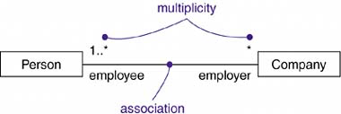

# UML

笔记基于 UML用户指南（第2版）（The Unified Modeling Language User Guide 2nd Edition）

## 建模
- 模型是对现实的简化
- 建模是为了能够更好地理解正在开发的系统
- UML是一种对软件密集型系统的制品进行下述工作的语言：可视化、详述、构造、文档化
### 建模技术
- 对系统的词汇建模
- 对系统中的职责分布建模：MVC
- 对简单类型建模：Boolean

## UML的构造块（Building Blocks of the UML）
### 事物（Things）
#### 结构事物（Structural things）
##### 类（class）

- 名称（name）：简单名、限定名 `java::awt::Rectangle`
- 属性（attribute）
- 操作（operation）
- 职责（responsibility）

##### 接口（interface）

##### 协作（collaboration）

##### 用况（use case）

##### 主动类（active class）

##### 构件（component）

##### 制品（artifact）

##### 结点（node）

#### 行为事物（Behavioral things）
交互注重一系列相互作用的对象；状态机注重一定时间内一个对象的生命周期；活动注重步骤之间的流
##### 交互（interaction）

##### 状态机（state machine）

##### 活动（activity）

#### 分组事物（Grouping things）
##### 包（package）

#### 注释事物（Annotational things）
##### 注解（note）

### 关系（Relationships）
#### 依赖（dependency）
使用关系：精化、跟踪和绑定 

#### 关联（association）
结构关系 

##### 名称（association names）

##### 角色（association end names (role names)）

##### 多重性（multiplicity）

##### 聚合（aggregation, "has-a"）

#### 泛化（generalization, "is-a-kind-of"）
特殊／一般关系 

#### 实现（realization）
接口和实现它们的类或构件之间；用况和实现它们的协作之间 

### 图（Diagrams）
#### 类图（class diagram）
#### 对象图（object diagram）
#### 构件图（component diagram）
#### 组合结构图（composite structure diagram）
#### 用狂图（use case diagram）
#### 顺序图（sequence diagram）
#### 通信图（communication diagram）
#### 状态图（state diagram）
#### 活动图（activity diagram）
#### 部署图（deployment diagram）
#### 包图（package diagram）
#### 定时图（timing diagram）
#### 交互概览图（interaction overview diagram）

## UML中的公共机制（Common Mechanisms in the UML）
### 详述（Specifications）
### 修饰（Adornments）
抽象；可见性：公共、受保护、私有 

### 通用划分（Common divisions）
类和对象；接口和实现；类型和角色
### 扩展机制（Extensibility mechanisms）

#### 衍型（stereotype）
如：`class Overflow`
#### 标记值（tagged value）
如：`class EventQueue`
#### 约束（constraint）
如：`{ordered}`

## 体系结构（Architecture）

### 用况视图（use case view）
静态：用况图；动态：交互图、状态图和活动图
### 设计视图（design view）
静态：类图和对象图；动态：交互图、状态图和活动图
### 交互视图（interaction view）
静态：类图和对象图；动态：交互图、状态图和活动图
### 实现视图（implementation view）
静态：构件图；动态：交互图、状态图和活动图
### 部署视图（deployment view）
静态：部署图；动态：交互图、状态图和活动图
