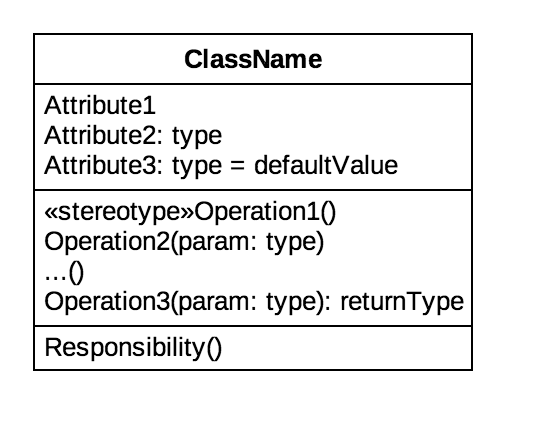

# UML

笔记基于 UML用户指南（第2版）（The Unified Modeling Language User Guide 2nd Edition）

## 基础
- 模型是对现实的简化
- 建模是为了能够更好地理解正在开发的系统
- UML是一种对软件密集型系统的制品进行下述工作的语言：可视化、详述、构造、文档化

## UML的构造块（Building Blocks of the UML）
### 事物（Things）
#### 结构事物（Structural things）
##### 类（class）

##### 接口（interface）
##### 协作（collaboration）
##### 用况（use case）
##### 主动类（active class）
##### 构件（component）
##### 制品（artifact）
##### 结点（node）

#### 行为事物（Behavioral things）

#### 分组事物（Grouping things）
#### 注释事物（Annotational things）

### 关系（Relationships）

### 图（Diagrams）
