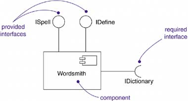
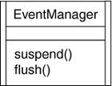
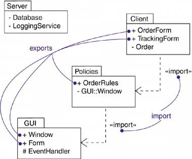

# UML

* [UML](#uml)
  * [建模](#%E5%BB%BA%E6%A8%A1)
    * [建模技术](#%E5%BB%BA%E6%A8%A1%E6%8A%80%E6%9C%AF)
  * [UML的构造块（Building Blocks of the UML）](#uml%E7%9A%84%E6%9E%84%E9%80%A0%E5%9D%97building-blocks-of-the-uml)
    * [事物（Things）](#%E4%BA%8B%E7%89%A9things)
      * [结构事物（Structural things）](#%E7%BB%93%E6%9E%84%E4%BA%8B%E7%89%A9structural-things)
        * [类（class）](#%E7%B1%BBclass)
        * [接口（interface）](#%E6%8E%A5%E5%8F%A3interface)
        * [协作（collaboration）](#%E5%8D%8F%E4%BD%9Ccollaboration)
        * [用况（use case）](#%E7%94%A8%E5%86%B5use-case)
        * [主动类（active class）](#%E4%B8%BB%E5%8A%A8%E7%B1%BBactive-class)
        * [构件（component）](#%E6%9E%84%E4%BB%B6component)
        * [制品（artifact）](#%E5%88%B6%E5%93%81artifact)
        * [结点（node）](#%E7%BB%93%E7%82%B9node)
      * [行为事物（Behavioral things）](#%E8%A1%8C%E4%B8%BA%E4%BA%8B%E7%89%A9behavioral-things)
        * [交互（interaction）](#%E4%BA%A4%E4%BA%92interaction)
        * [状态机（state machine）](#%E7%8A%B6%E6%80%81%E6%9C%BAstate-machine)
        * [活动（activity）](#%E6%B4%BB%E5%8A%A8activity)
      * [分组事物（Grouping things）](#%E5%88%86%E7%BB%84%E4%BA%8B%E7%89%A9grouping-things)
        * [包（package）](#%E5%8C%85package)
      * [注释事物（Annotational things）](#%E6%B3%A8%E9%87%8A%E4%BA%8B%E7%89%A9annotational-things)
        * [注解（note）](#%E6%B3%A8%E8%A7%A3note)
    * [关系（Relationships）](#%E5%85%B3%E7%B3%BBrelationships)
      * [依赖（dependency）](#%E4%BE%9D%E8%B5%96dependency)
      * [关联（association）](#%E5%85%B3%E8%81%94association)
        * [名称（association names）](#%E5%90%8D%E7%A7%B0association-names)
        * [角色（association end names (role names)）](#%E8%A7%92%E8%89%B2association-end-names-role-names)
        * [多重性（multiplicity）](#%E5%A4%9A%E9%87%8D%E6%80%A7multiplicity)
        * [聚合（aggregation, "has\-a"）](#%E8%81%9A%E5%90%88aggregation-has-a)
        * [导航（navigation）](#%E5%AF%BC%E8%88%AAnavigation)
        * [可见性（visibility）](#%E5%8F%AF%E8%A7%81%E6%80%A7visibility)
        * [限定（qualification）](#%E9%99%90%E5%AE%9Aqualification)
        * [组合（composition）](#%E7%BB%84%E5%90%88composition)
        * [关联类（association classes）](#%E5%85%B3%E8%81%94%E7%B1%BBassociation-classes)
      * [泛化（generalization, "is\-a\-kind\-of"）](#%E6%B3%9B%E5%8C%96generalization-is-a-kind-of)
      * [实现（realization）](#%E5%AE%9E%E7%8E%B0realization)
    * [图（Diagrams）](#%E5%9B%BEdiagrams)
      * [类图（class diagram）](#%E7%B1%BB%E5%9B%BEclass-diagram)
        * [内容](#%E5%86%85%E5%AE%B9)
        * [用法](#%E7%94%A8%E6%B3%95)
      * [对象图（object diagram）](#%E5%AF%B9%E8%B1%A1%E5%9B%BEobject-diagram)
      * [构件图（component diagram）](#%E6%9E%84%E4%BB%B6%E5%9B%BEcomponent-diagram)
      * [组合结构图（composite structure diagram）](#%E7%BB%84%E5%90%88%E7%BB%93%E6%9E%84%E5%9B%BEcomposite-structure-diagram)
      * [用狂图（use case diagram）](#%E7%94%A8%E7%8B%82%E5%9B%BEuse-case-diagram)
      * [顺序图（sequence diagram）](#%E9%A1%BA%E5%BA%8F%E5%9B%BEsequence-diagram)
      * [通信图（communication diagram）](#%E9%80%9A%E4%BF%A1%E5%9B%BEcommunication-diagram)
      * [状态图（state diagram）](#%E7%8A%B6%E6%80%81%E5%9B%BEstate-diagram)
      * [活动图（activity diagram）](#%E6%B4%BB%E5%8A%A8%E5%9B%BEactivity-diagram)
      * [部署图（deployment diagram）](#%E9%83%A8%E7%BD%B2%E5%9B%BEdeployment-diagram)
      * [包图（package diagram）](#%E5%8C%85%E5%9B%BEpackage-diagram)
      * [定时图（timing diagram）](#%E5%AE%9A%E6%97%B6%E5%9B%BEtiming-diagram)
      * [交互概览图（interaction overview diagram）](#%E4%BA%A4%E4%BA%92%E6%A6%82%E8%A7%88%E5%9B%BEinteraction-overview-diagram)
  * [UML中的公共机制（Common Mechanisms in the UML）](#uml%E4%B8%AD%E7%9A%84%E5%85%AC%E5%85%B1%E6%9C%BA%E5%88%B6common-mechanisms-in-the-uml)
    * [详述（Specifications）](#%E8%AF%A6%E8%BF%B0specifications)
    * [修饰（Adornments）](#%E4%BF%AE%E9%A5%B0adornments)
    * [通用划分（Common divisions）](#%E9%80%9A%E7%94%A8%E5%88%92%E5%88%86common-divisions)
    * [扩展机制（Extensibility mechanisms）](#%E6%89%A9%E5%B1%95%E6%9C%BA%E5%88%B6extensibility-mechanisms)
      * [衍型（stereotype）](#%E8%A1%8D%E5%9E%8Bstereotype)
      * [标记值（tagged value）](#%E6%A0%87%E8%AE%B0%E5%80%BCtagged-value)
      * [约束（constraint）](#%E7%BA%A6%E6%9D%9Fconstraint)
  * [体系结构（Architecture）](#%E4%BD%93%E7%B3%BB%E7%BB%93%E6%9E%84architecture)
    * [用况视图（use case view）](#%E7%94%A8%E5%86%B5%E8%A7%86%E5%9B%BEuse-case-view)
    * [设计视图（design view）](#%E8%AE%BE%E8%AE%A1%E8%A7%86%E5%9B%BEdesign-view)
    * [交互视图（interaction view）](#%E4%BA%A4%E4%BA%92%E8%A7%86%E5%9B%BEinteraction-view)
    * [实现视图（implementation view）](#%E5%AE%9E%E7%8E%B0%E8%A7%86%E5%9B%BEimplementation-view)
    * [部署视图（deployment view）](#%E9%83%A8%E7%BD%B2%E8%A7%86%E5%9B%BEdeployment-view)

笔记基于 UML用户指南（第2版）（The Unified Modeling Language User Guide 2nd Edition）

## 建模
- 模型是对现实的简化
- 建模是为了能够更好地理解正在开发的系统
- UML是一种对软件密集型系统的制品进行下述工作的语言：可视化、详述、构造、文档化
- 系统表示正在开发的事物，通过不用的模型从不同的角度对系统进行观察，并以图的形式来表示这些视图。

### 建模技术
- 对系统中的职责分布建模：MVC
- 对简单类型建模：Boolean
- 对注释建模<br>

- 对新特征建模<br>

- 对新语义建模<br>

- 对系统的不同视图建模
- 对不同的抽象层次建模
- 对关系网建模：结构关系 --> 一般／特殊关系 --> 依赖关系

## UML的构造块（Building Blocks of the UML）
### 事物（Things）
#### 结构事物（Structural things）
##### 类（class）

- 名称（name）：简单名、限定名 `java::awt::Rectangle`
- 属性（attribute）：`[visibility] name [':' type]['[' multiplicity ']']['=' initial-value][property-string {',' property-string}]`
    - `origin`                  Name only
    - `+ origin`                Visibility and name
    - `name : String[0..1]`     Name, type, and multiplicity
    - `origin : Point = (0,0)`  Name, type, and initial value
    - `id: Integer {readonly}`  Name and property
- 操作（operation）：`[visibility] name ['(' parameter-list ')'][':' return-type][property-string {',' property-string}]`
    - 特性（property）
        - 叶子（leaf）：没有任何子类
        - 抽象（abstract）：没有任何直接的实例
        - 查询（query）：操作的执行不会改变系统的状态
        - 顺序（sequential）：调用者必须在对象外部进行协调，以保证在对象中一次仅有一个流
        - 监护（guarded）：通过将所有对象监护操作的所有调用顺序化，来保证在出现多控制流的情况下对象的语义和完整性
        - 并发（concurrent）：通过把操作原子化，来保证在出现多控制流的情况下对象的语义和完整性
        - 静态（static）：操作没有关于目标对象的隐式参数，它的行为如同传统的全局过程
- 职责（responsibility）
- 可见性（visibility）<br>

- 拥有者范围（owner scope）<br>

- 抽象元素、叶子元素和多态性元素（abstract, leaf, and polymorphic elements）<br>

- 多重性（multiplicity）<br>

- 标准衍型
    - 元类（metaclass）：一个对象全是类的类目
    - 幂类型（powertype）：一个对象是给定父类的子类的类目
    - 衍型（stereotype）：一个可用于其他元素的衍型的类目
    - 实用程序（utility）：一个属性和操作都是静态范围的类

##### 接口（interface）
接口是一组操作的集合，这组操作用于描述类或构件的一个服务。<br>


类型（type）是类的一个衍型，用于描述一组对象的域以及作用于对象的操作。
角色（role）是一个参与特定语境的实体的行为。<br>
实现接口的简化形式和展开形式<br>

###### 对系统中的接缝建模（Modeling the Seams in a System）
这个构件提供（实现）了3个接口：IUnknown, ILedger, IReports；<br>
这个构件需要（使用）了2个接口：IStreaming, ITransaction<br>


##### 协作（collaboration）

##### 用况（use case）

##### 主动类（active class）

##### 构件（component）

##### 制品（artifact）

##### 结点（node）


#### 行为事物（Behavioral things）
交互注重一系列相互作用的对象；状态机注重一定时间内一个对象的生命周期；活动注重步骤之间的流
##### 交互（interaction）

##### 状态机（state machine）

##### 活动（activity）


#### 分组事物（Grouping things）
##### 包（package）


#### 注释事物（Annotational things）
##### 注解（note）
文字、文档链接、URL<br>


### 关系（Relationships）
#### 依赖（dependency）


**衍型**
- 类和对象之间
    - 绑定（bind）：源用给定的实际参数实例化目标模版；绑定包括一个映射到模版的形式参数的实际参数列表
    - 导出（derive）：可以从目标计算出源
    - 允许（permit）：源对目标给予特定的可见性（例如 C++ 中的 friend 类）
    - 的实例（instanceOf）：源对象是目标类目的一个实例
    - 实例化（instantiate）：源创建目标的实例
    - 幂类型（powertype）：目标是源的幂类型
    - 精化（refine）：源比目标处于更精细的抽象程度上
    - 使用（use）：源元素的语义依赖于目标元素的公共部分的语义
- 包之间
    - 引入（import）：目标包中的公共内容加入到源包的公共命名空间中
    - 访问（access）：目标包中的公共内容加入到源包的私有命名空间中
- 用况之间
    - 延伸（extend）：目标用况扩展了源用况的行为
    - 包含（include）：源用况在源所指定的位置上显式地合并了另一个用况的行为
- 对象之间
    - 发送（send）：源类把事件发送给目标
- 系统
    - 跟踪（trace）：目标是源的早期开发阶段的祖先

#### 关联（association）


结构关系<br>
**约束**
- 有序（ordered）：关联一端的对象集是显式有序的
- 集合（set）：对象唯一，不可以重复
- 袋（bag）：对象不唯一，可以重复
- 有序集合（order set）：对象唯一且有序
- 表（list）或序列（sequence）：对象有序但可以重复
- 只读（readonly）：一旦从关联的另一端的对象添加了一个链，就不可以修改或删除

##### 名称（association names）

##### 角色（association end names (role names)）

##### 多重性（multiplicity）

##### 聚合（aggregation, "has-a"）

##### 导航（navigation）

##### 可见性（visibility）

##### 限定（qualification）

##### 组合（composition）
强拥有关系（整体与部分的生命周期是一致的）<br>

##### 关联类（association classes）


#### 泛化（generalization, "is-a-kind-of"）


特殊／一般关系；多继承<br>
**约束**
- 完全（complete）：已经在模型中给出了泛化关系中的所有子类，不允许再有更多的子类（一些子类可能在图中省略；省略和模型的完整性不同）
- 不完全（incomplete）：没有给出泛化中的所有子类，允许再添加子类
- 互斥（disjoint）：父类的对象最多以给定的子类中的一个子类作为类型（只应用于多继承语境中）
- 重叠（overlapping）：父类的对象可能以给定的子类中的一个以上子类作为类型（只应用于多继承语境中）

#### 实现（realization）
接口和实现它们的类或构件之间；用况和实现它们的协作之间<br>


### 图（Diagrams）
结构图（Structural Diagrams）：
- 类图（类、接口、协作）
- 构件图（构件）
- 组合结构图（内部结构）
- 对象图（对象）
- 制品图（制品）
- 部署图（结点）

行为图（Behavioral Diagrams）：
- 用况图：组织系统的行为
- 顺序图：注重消息的时间次序
- 通信图：注重收发消息的对象的结构组织
- 状态图：注重由事件驱动的系统状态变化
- 活动图：注重从活动到活动的控制流

#### 类图（class diagram）

##### 内容
- 类
- 接口
- 依赖、泛化和关联关系
- 注解和约束

##### 用法
- 对系统的词汇建模
- 对简单协作建模
- 对逻辑数据库模式建模<br>

- 正向工程（forward engineering）：把模型转换成代码<br>

```java
public abstract class EventHandler {
    EventHandler successor;
    private Integer currentEventID;
    private String source;

    EventHandler() {}
    public void handleRequest() {}
}
```

#### 对象图（object diagram）
#### 构件图（component diagram）
#### 组合结构图（composite structure diagram）
#### 用狂图（use case diagram）
#### 顺序图（sequence diagram）
#### 通信图（communication diagram）
#### 状态图（state diagram）
#### 活动图（activity diagram）
#### 部署图（deployment diagram）
#### 包图（package diagram）
#### 定时图（timing diagram）
#### 交互概览图（interaction overview diagram）

### 其他
#### 实例（instance）
- 实例是抽象的具体表现；对象是类的实例
- 一个实例有一个类型（具体的类目）；实例的类目通常是静态的

## UML中的公共机制（Common Mechanisms in the UML）
### 详述（Specifications）
### 修饰（Adornments）
抽象；可见性：公共、受保护、私有<br>

### 通用划分（Common divisions）
类和对象；接口和实现；类型和角色
### 扩展机制（Extensibility mechanisms）

#### 衍型（stereotype）
如：`class Overflow`
#### 标记值（tagged value）
如：`name = value`
#### 约束（constraint）
如：`{ordered}` <br>


## 体系结构（Architecture）

### 用况视图（use case view）
静态：用况图；动态：交互图、状态图和活动图
### 设计视图（design view）
静态：类图和对象图；动态：交互图、状态图和活动图
### 交互视图（interaction view）
静态：类图和对象图；动态：交互图、状态图和活动图
### 实现视图（implementation view）
静态：构件图；动态：交互图、状态图和活动图
### 部署视图（deployment view）
静态：部署图；动态：交互图、状态图和活动图
